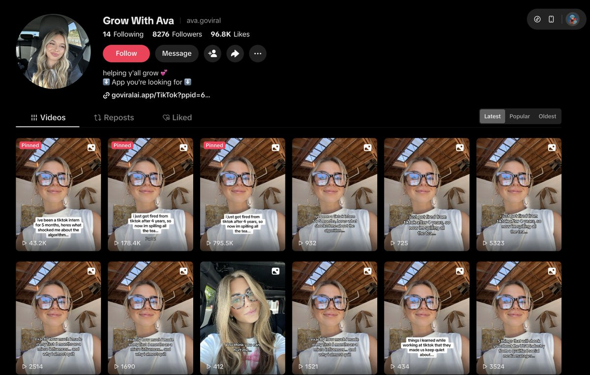

# TikTok 幻灯片内容生产流水线

这是一个基于阿里云百炼 API、本地 Node.js 脚本和 `bl` CLI 的 TikTok slideshow 内容生产工具。它可以从参考内容拆解开始，生成内容方案、背景图、9:16 幻灯片图片，也可以进一步创建短视频生成、动作参考和主体替换任务。

最终产物包括：

- 爆款拆解报告
- 可执行内容简报
- TikTok slideshow 文案方案
- 背景图
- 1080x1920 PNG 幻灯片
- 可选短视频素材
- 动作参考视频和主体替换视频

详细流程图见 [docs/FLOWCHART.md](docs/FLOWCHART.md)，视频工作流见 [docs/VIDEO_WORKFLOW.md](docs/VIDEO_WORKFLOW.md)，完整说明文档见 [docs/ARTICLE_ZH_LOCALIZED.md](docs/ARTICLE_ZH_LOCALIZED.md)。

## 现在可以做什么

1. **爆款拆解**
   读取人工整理的 TikTok 参考内容，输出 hook 模式、页面结构、视觉风格和避坑点。

2. **内容简报生成**
   把爆款拆解结果转成 `data/input.generated.json`，作为后续生成 slideshow 的输入。

3. **幻灯片方案生成**
   生成 `slides-config.json`，包含每页文案、字号、位置、caption、图片路径和视觉搜索词。

4. **背景图生成**
   根据每页主题调用百炼图像生成 API，自动保存到 `imagePath` 指定的位置；也可以直接使用第 4 步内置的角色参考图、换装图和爆款参考截图。

5. **本地图片渲染**
   使用 Node.js Canvas 将背景图和文字叠加，批量输出 9:16 PNG。

6. **短视频任务**
   创建百炼视频生成异步任务，轮询 `task_id`，成功后下载视频结果。

7. **视频下载和动作参考**
   下载参考视频，用 `ffmpeg` 裁剪动作段、抽帧、生成 contact sheet，并用 `ffprobe` 检查视频参数。

8. **参考视频换主体**
   用 `bl video ref` 或 `bl video edit` 输入参考动作视频和角色图，保留动作、镜头、节奏和场景，替换主角。

9. **手动发布素材**
   输出的图片和视频可以手动上传到 TikTok、Reels、Shorts 或其它短内容平台。

## 用到的能力

### 百炼 OpenAI 兼容接口

用于文本生成和结构化 JSON 输出：

- 爆款内容拆解
- hook 模式总结
- slideshow 内容简报
- 每页文案和 caption
- Pinterest 搜索词 / 生图提示词方向

默认配置：

```bash
BAILIAN_BASE_URL=https://dashscope.aliyuncs.com/compatible-mode/v1
BAILIAN_MODEL=qwen-plus
```

### 百炼图像生成 API

用于生成每页 slideshow 背景图：

- 9:16 竖版背景图
- 统一视觉风格
- 适合叠字的留白画面
- 无文字、无 logo、无水印背景

默认配置：

```bash
BAILIAN_NATIVE_BASE_URL=https://dashscope.aliyuncs.com/api/v1
BAILIAN_IMAGE_MODEL=qwen-image-2.0-pro
BAILIAN_IMAGE_SIZE=1080*1920
```

### 百炼视频生成 API

用于把 slideshow 主题扩展成短视频：

- 文生视频
- 图生视频
- 首尾帧视频
- 参考生视频
- 动态背景素材

默认配置：

```bash
BAILIAN_VIDEO_MODEL=wan2.7-t2v
BAILIAN_VIDEO_RESOLUTION=720P
BAILIAN_VIDEO_RATIO=9:16
BAILIAN_VIDEO_DURATION=5
```

视频生成是异步任务，需要先创建任务，再用 `task_id` 轮询结果。

### `bl` CLI 视频编辑能力

用于参考视频动作和主体替换：

- 下载或复用本地参考视频
- 裁剪动作片段并抽关键帧
- 用 `wan2.2-animate-mix` 尝试动作迁移
- 用 `wan2.7-videoedit` 做视频编辑和主体替换
- 成功后自动下载视频，并用 `ffprobe` / `ffmpeg` 校验

本能力依赖本机已登录并可用的 `bl` CLI。

### 本地渲染能力

使用 `@napi-rs/canvas` 在本地渲染图片：

- 输出尺寸：1080x1920
- 自动 cover-fit 背景图
- 深色蒙版
- 居中文字叠加
- 自动换行
- 缺少背景图时使用 fallback 背景

## 安装

```bash
npm install
cp .env.example .env
```

编辑 `.env`：

```bash
DASHSCOPE_API_KEY=sk-your-bailian-api-key
BAILIAN_BASE_URL=https://dashscope.aliyuncs.com/compatible-mode/v1
BAILIAN_MODEL=qwen-plus
BAILIAN_NATIVE_BASE_URL=https://dashscope.aliyuncs.com/api/v1
BAILIAN_IMAGE_MODEL=qwen-image-2.0-pro
BAILIAN_IMAGE_SIZE=1080*1920
BAILIAN_VIDEO_MODEL=wan2.7-t2v
BAILIAN_VIDEO_RESOLUTION=720P
BAILIAN_VIDEO_RATIO=9:16
BAILIAN_VIDEO_DURATION=5
```

不要把真实 API Key 写进源码或提交到 Git。

## 快速开始

### 1. 只测试本地渲染

这一步不需要 API Key。

```bash
npm run render -- data/slides-config.sample.json output
```

输出：

```text
output/
  slide_01.png
  slide_02.png
  slide_03.png
```

### 2. 爆款拆解

复制示例文件：

```bash
cp data/viral-references.example.json data/viral-references.json
```

编辑 `data/viral-references.json`，填入你观察到的参考内容。

运行：

```bash
npm run analyze -- data/viral-references.json data/viral-analysis.json data/input.generated.json
```

输出：

- `data/viral-analysis.json`
- `data/input.generated.json`

### 3. 生成 slideshow 方案

```bash
npm run plan -- data/input.generated.json data/slides-config.json
```

输出：

- `data/slides-config.json`

### 4. 生成背景图

```bash
npm run images -- data/slides-config.json
```

脚本会逐页调用百炼图像生成 API，并把背景图保存到 `slides-config.json` 中每页的 `imagePath`。

如果已经有可用图片，也可以跳过自动生图，把图片路径直接写入 `slides-config.json` 的 `imagePath`。本仓库已内置一组第 4 步示例素材：

- 角色三视图：`assets/step-04/character_reference_three_view.png`
- 换装参考：`assets/step-04/outfit_01.png` 到 `assets/step-04/outfit_08.png`
- 爆款幻灯片参考截图：`assets/step-04/viral_slideshow_reference.png`

示例图：

<p>
  
  
  
  
  
  
  
  
  
  
</p>

### 5. 渲染最终 PNG

```bash
npm run render -- data/slides-config.json output
```

输出的 PNG 可以直接作为 TikTok slideshow 素材使用。

### 6. 创建短视频任务

复制示例文件：

```bash
cp data/video-task.example.json data/video-task.json
```

创建任务：

```bash
npm run video:create -- data/video-task.json data/video-task.created.json
```

查询任务：

```bash
npm run video:poll -- data/video-task.created.json data/video-task.result.json
```

如果任务成功并返回视频 URL，脚本会下载到：

```text
output/video/
```

如果状态仍是 `PENDING` 或 `RUNNING`，稍后再次运行 `video:poll`。

### 7. 视频下载、动作参考和主体替换

完整说明见 [docs/VIDEO_WORKFLOW.md](docs/VIDEO_WORKFLOW.md)。

下载参考视频：

```bash
npm run video:download -- data/video-download.example.json
```

裁剪动作参考、抽帧并生成 contact sheet：

```bash
npm run video:motion -- data/motion-reference.example.json
```

尝试动作迁移：

```bash
npm run video:ref -- data/video-ref.example.json
```

使用视频编辑模型替换主体：

```bash
npm run video:edit -- data/video-edit.example.json
```

检查生成视频参数并抽帧：

```bash
npm run video:check -- data/video-check.example.json
```

实际使用建议：

- `wan2.2-animate-mix` 更适合单人、正面、人体清晰的动作迁移。
- 参考视频如果从背影、侧身或遮挡开始，优先用 `wan2.7-videoedit`。
- `duration` 必须小于或等于输入视频真实时长。

## 输入文件说明

### `data/viral-references.example.json`

用于记录参考内容。

核心字段：

- `niche`：内容领域
- `language`：输出语言
- `audience`：目标受众
- `desiredSlideCount`：目标页数
- `references`：参考内容列表
- `goal`：内容目标

### `data/input.example.json`

手动内容简报示例。也可以由 `npm run analyze` 自动生成 `data/input.generated.json`。

### `data/slides-config.sample.json`

本地渲染示例。用于无 API Key 情况下测试图片渲染链路。

### `data/video-task.example.json`

视频生成任务示例。可修改 `model`、`prompt` 和 `parameters` 后提交。

### `data/video-download.example.json`

直接视频链接下载示例。用于把参考动作视频保存到 `output/reference/`。

### `data/motion-reference.example.json`

动作参考预处理示例。用于裁剪参考视频、抽第一帧、生成 contact sheet 和输出视频参数。

### `data/video-ref.example.json`

`bl video ref` 示例。用于参考视频动作迁移，默认模型是 `wan2.2-animate-mix`。

### `data/video-edit.example.json`

`bl video edit` 示例。用于参考动作视频 + 角色图的主体替换，默认模型是 `wan2.7-videoedit`。

### `data/video-check.example.json`

视频结果校验示例。用于 `ffprobe` 参数检查和 `ffmpeg` 抽 contact sheet。

## 输出文件说明

```text
data/viral-analysis.json        # 爆款拆解报告
data/input.generated.json       # 生成后的内容简报
data/slides-config.json         # slideshow 渲染配置
pinterest_images/<niche>/       # 背景图
output/                         # 最终 PNG
output/video/                   # 视频结果
output/reference/               # 参考视频、关键帧、contact sheet
```

## 命令总览

```bash
npm run analyze      # 爆款拆解
npm run plan         # 生成 slideshow 方案
npm run images       # 调用百炼生图
npm run render       # 本地渲染 PNG
npm run video:download # 下载参考视频
npm run video:motion # 裁剪动作参考并抽帧
npm run video:ref    # 参考视频动作迁移
npm run video:edit   # 视频编辑和主体替换
npm run video:create # 创建视频异步任务
npm run video:poll   # 查询并下载视频结果
npm run video:check  # 检查视频参数并抽帧
```

## 文件结构

```text
.
├── README.md
├── docs/
│   ├── FLOWCHART.md
│   ├── VIDEO_WORKFLOW.md
│   └── ARTICLE_ZH_LOCALIZED.md
├── assets/
│   └── step-04/
│       ├── character_reference_three_view.png
│       ├── outfit_01.png
│       ├── ...
│       └── viral_slideshow_reference.png
├── .env.example
├── package.json
├── data/
│   ├── input.example.json
│   ├── motion-reference.example.json
│   ├── slides-config.sample.json
│   ├── video-check.example.json
│   ├── video-download.example.json
│   ├── video-edit.example.json
│   ├── video-ref.example.json
│   ├── viral-references.example.json
│   └── video-task.example.json
├── pinterest_images/
│   └── finance/
├── scripts/
│   ├── analyze-viral.mjs
│   ├── check-video.mjs
│   ├── create-video-task.mjs
│   ├── download-video.mjs
│   ├── generate-images.mjs
│   ├── generate-plan.mjs
│   ├── prepare-motion-reference.mjs
│   ├── poll-task.mjs
│   ├── render-slides.mjs
│   └── run-bl-video.mjs
└── output/
```

## 注意事项

- `.env` 不要提交。
- 图像和视频模型的地域、模型名、Endpoint、API Key 必须匹配。
- 视频生成是异步任务，拿到 `task_id` 后轮询即可，不要重复提交同一个任务。
- 图像和视频结果 URL 建议及时下载保存。
- 生成内容应复用结构和节奏，不要逐字复制参考内容。

## 参考

- 百炼 OpenAI 兼容接口：`wiki/concepts/openai-compatible-interface.md`
- 百炼图像生成 API：`wiki/api/image-generation.md`
- 百炼视频生成 API：`wiki/api/video-generation-api.md`
- 百炼异步调用机制：`wiki/concepts/async-invocation.md`
- 图像、视频与 3D 生成对比：`wiki/comparisons/multimodal-generation-comparison.md`
- 百炼 API Key 环境变量：`DASHSCOPE_API_KEY`
- 默认兼容接口地址：`https://dashscope.aliyuncs.com/compatible-mode/v1`
