# TikTok 幻灯片内容生产流程图

这份文档把当前 skill 的完整能力拆成 10 个步骤。每个步骤都说明它做什么、输入是什么、输出是什么、对应命令是什么，并配一张示意图。

## 总流程图

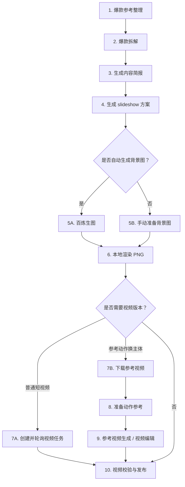

## 步骤 1：爆款参考整理

做什么：

- 人工观察 TikTok 同领域 slideshow。
- 记录第一屏 hook、页数结构、视觉风格、评论反馈和内容目标。
- 把这些信息写成结构化 JSON，作为后续 AI 拆解的输入。

步骤说明：

- 这一步是整个流程的数据入口，质量决定后面生成内容是否有方向。
- 不需要一次记录很多参考，先从 3-5 条同领域内容开始即可。
- 重点不是抄文案，而是记录“为什么它能让人停下来看”。
- 完成标准是：每条参考都能说清楚第一屏 hook、页面结构和视觉风格。
- 下一步会把这些观察交给百炼模型做结构化拆解。

输入：

- TikTok 参考内容
- 人工观察记录

输出：

- `data/viral-references.json`

命令：

```bash
cp data/viral-references.example.json data/viral-references.json
```

示意图：

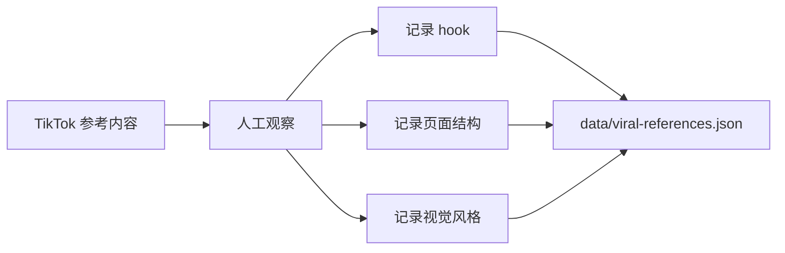

## 步骤 2：爆款拆解

做什么：

- 调用百炼 OpenAI 兼容接口。
- 把人工记录拆成可复用的 hook 模式、页面结构、视觉模式和避坑点。
- 分离“可观察事实”和“策略判断”，避免直接复制原文案。

步骤说明：

- 这一步把零散观察转换成可复用规律。
- 模型会总结哪些 hook 可以复用、哪些表达要避免、哪些视觉模式适合继续沿用。
- `viral-analysis.json` 是给人看的分析结果，适合复盘和选题讨论。
- `input.generated.json` 是给脚本看的内容简报，后续会直接进入方案生成。
- 完成标准是：输出里有明确 hook 模式、结构模式、视觉模式和目标受众描述。

输入：

- `data/viral-references.json`

输出：

- `data/viral-analysis.json`
- `data/input.generated.json`

命令：

```bash
npm run analyze -- data/viral-references.json data/viral-analysis.json data/input.generated.json
```

示意图：

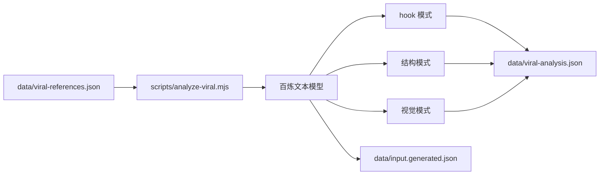

## 步骤 3：生成 slideshow 方案

做什么：

- 根据内容简报生成可执行 slideshow 配置。
- 规划每页文案、字号、位置、caption、图片路径和视觉搜索词。
- 输出给后续生图和渲染脚本使用的核心配置文件。

步骤说明：

- 这一步把“内容方向”变成“可渲染配置”。
- 每一页都会被写成结构化数据，包括背景图路径、文字内容、字号、字重和 Y 坐标。
- `caption` 可以作为 TikTok 发布时的正文草稿。
- `pinterestQueries` 既可以用于手动找图，也可以作为百炼生图时的视觉方向。
- 完成标准是：`slides-config.json` 里存在 `slides` 数组，并且每一页都有 `imagePath` 和 `lines`。

输入：

- `data/input.generated.json`

输出：

- `data/slides-config.json`

命令：

```bash
npm run plan -- data/input.generated.json data/slides-config.json
```

示意图：

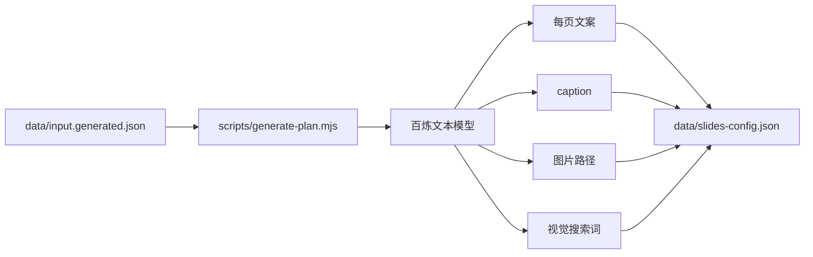

## 步骤 4：背景图准备

做什么：

- 给每一页 slideshow 准备背景图。
- 可以手动下载图片，也可以调用百炼图像生成 API 自动生成。
- 可以直接使用 `assets/step-04/` 中的角色参考图、换装图和爆款参考截图。
- 背景图会保存到 `slides-config.json` 中每页 `imagePath` 指向的位置。

步骤说明：

- 这一步负责解决“画面素材”问题。
- 如果你已有 Pinterest 或自有图片，可以跳过 `npm run images`，直接把图片放到对应路径。
- 如果要保持角色一致性，可以使用 `character_reference_three_view.png` 做角色设定参考，再用 `outfit_01.png` 到 `outfit_08.png` 做换装参考。
- `viral_slideshow_reference.png` 用来辅助判断爆款幻灯片封面、文字位置和内容钩子，不建议直接作为最终背景图。
- 如果调用百炼生图，脚本会根据每页文案自动组织背景图 prompt。
- 背景图应该给文字留出干净区域，避免自带大段文字、logo 或水印。
- 完成标准是：`slides-config.json` 中每个 `imagePath` 都能在本地找到对应图片文件。

输入：

- `data/slides-config.json`
- 百炼图像生成配置
- 可选本地素材：`assets/step-04/`

输出：

- `pinterest_images/<niche>/image_001.jpg`
- `pinterest_images/<niche>/image_002.jpg`
- 更多背景图文件
- 或直接复用 `assets/step-04/*.png`

命令：

```bash
npm run images -- data/slides-config.json
```

示意图：

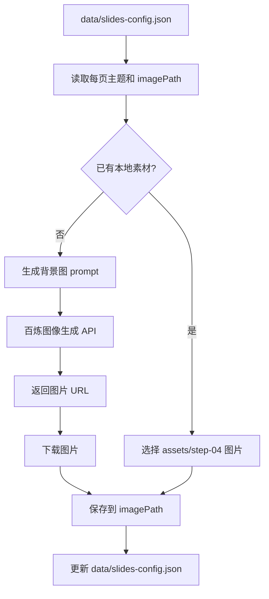

第 4 步示例素材：

<p>
  
  
  
  
  
  
  
  
  
  
</p>

## 步骤 5：本地渲染 PNG

做什么：

- 使用本地 Canvas 把背景图和文字合成。
- 自动 cover-fit 背景图，加深色蒙版，居中叠字，并自动换行。
- 批量输出 TikTok 可用的 1080x1920 PNG。

步骤说明：

- 这一步把配置文件和背景图合成为最终可发布图片。
- 渲染器会把背景图按 9:16 填满画布，不够的部分自动裁切。
- 深色蒙版用于提升白字可读性，避免画面太花导致文字看不清。
- 如果背景图缺失，脚本会使用 fallback 背景，方便先测试流程。
- 完成标准是：`output/` 目录里出现 `slide_01.png`、`slide_02.png` 等图片。

输入：

- `data/slides-config.json`
- 背景图文件

输出：

- `output/slide_01.png`
- `output/slide_02.png`
- 更多 PNG 幻灯片

命令：

```bash
npm run render -- data/slides-config.json output
```

示意图：

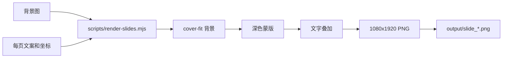

## 步骤 6：短视频任务

做什么：

- 把 slideshow 主题扩展成短视频。
- 创建百炼视频异步任务，拿到 `task_id`。
- 轮询任务状态，成功后下载视频。

步骤说明：

- 这一步是可选扩展，不影响 slideshow PNG 生产。
- 适合把第一屏 hook 做成动态视频，或者把同一主题改成短视频版本。
- `video:create` 只负责提交任务并保存 `task_id`，不会立刻得到视频文件。
- `video:poll` 负责查询任务状态；如果成功，会自动下载返回的视频链接。
- 完成标准是：任务状态为 `SUCCEEDED`，并且 `output/video/` 下出现视频文件。

输入：

- `data/video-task.json`

输出：

- `data/video-task.created.json`
- `data/video-task.result.json`
- `output/video/`

命令：

```bash
cp data/video-task.example.json data/video-task.json
npm run video:create -- data/video-task.json data/video-task.created.json
npm run video:poll -- data/video-task.created.json data/video-task.result.json
```

示意图：

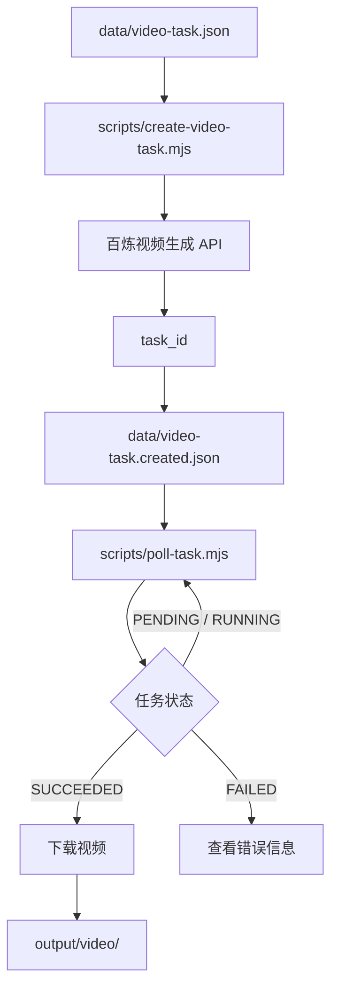

## 步骤 7：视频下载

做什么：

- 下载外部参考视频，作为动作参考素材。
- 如果平台链接不能直连下载，也可以先用本机下载工具拿到 mp4，再进入下一步。

步骤说明：

- 这一步对应实际会话里的 `video-downloader` 能力。
- 仓库内置脚本支持直接 mp4/mov/webm 链接下载。
- 输出文件建议放在 `output/reference/`，避免把大视频提交进 Git。
- 完成标准是：本地存在可被 `ffmpeg` 读取的参考视频。

输入：

- `data/video-download.example.json`
- 直接视频 URL

输出：

- `output/reference/reference_motion_raw.mp4`

命令：

```bash
npm run video:download -- data/video-download.example.json
```

示意图：

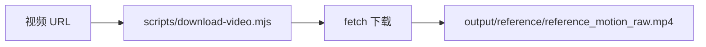

## 步骤 8：动作参考准备

做什么：

- 用 `ffmpeg` 裁剪动作片段。
- 抽第一帧和 contact sheet，检查人体是否清晰、动作是否连续、开头是否适合模型检测。
- 用 `ffprobe` 输出视频参数。

步骤说明：

- 这一步对应实际会话里的 `ffmpeg` / `ffprobe` 工具调用。
- 如果要跑 `wan2.2-animate-mix`，参考视频最好是单人、人体清晰、正面或接近正面开头。
- 如果检测失败并返回 `InvalidVideo.NoHuman` 或 `InvalidVideo.FrontBody`，优先改用 `wan2.7-videoedit`。
- 完成标准是：得到裁剪后参考视频、第一帧、contact sheet 和视频参数。

输入：

- `data/motion-reference.example.json`
- `output/reference/reference_motion_raw.mp4`

输出：

- `output/reference/reference_motion_9s.mp4`
- `output/reference/reference_motion_first.jpg`
- `output/reference/reference_motion_contact.jpg`

命令：

```bash
npm run video:motion -- data/motion-reference.example.json
```

示意图：

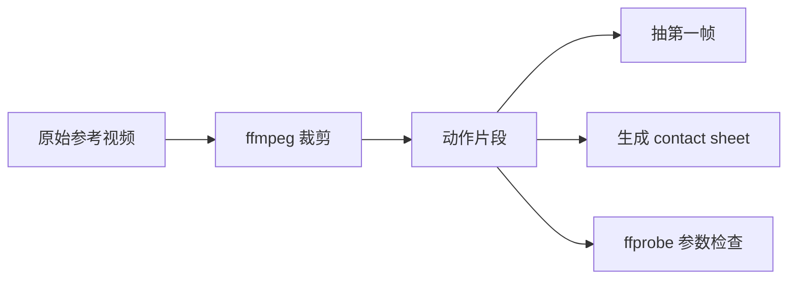

## 步骤 9：参考视频生成和主体替换

做什么：

- 用 `bl video ref` 尝试动作迁移。
- 用 `bl video edit` 做视频编辑和主体替换。
- 输入参考视频和角色图，尽量保留原动作、镜头、节奏、背景和音频。

步骤说明：

- 这一步对应实际会话里的 `bl` CLI 视频工具调用。
- `wan2.2-animate-mix` 更像专用动作迁移，要求参考视频质量更严格。
- `wan2.7-videoedit` 更适合“参考视频动作 + 参考图换主角”的通用主体替换。
- `duration` 不要超过输入视频真实时长。
- 完成标准是：`output/video/` 下出现下载好的生成视频。

输入：

- `data/video-ref.example.json`
- `data/video-edit.example.json`
- `output/reference/reference_motion_9s.mp4`
- `assets/step-04/character_reference_three_view.png`

输出：

- `output/video/doll_motion_animate_mix.mp4`
- `output/video/doll_motion_wan27_videoedit.mp4`

命令：

```bash
npm run video:ref -- data/video-ref.example.json
npm run video:edit -- data/video-edit.example.json
```

示意图：

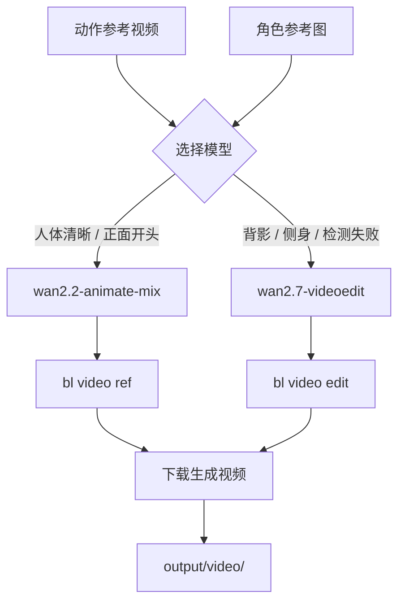

## 步骤 10：视频校验、人工发布与复盘

做什么：

- 用 `ffprobe` 检查生成视频参数。
- 用 `ffmpeg` 抽 contact sheet，快速肉眼检查主体替换和动作连续性。
- 把生成的 PNG 或视频手动上传到 TikTok、Reels、Shorts 等平台。
- 发布后记录表现，继续作为下一轮爆款拆解输入。
- 用真实数据更新下一轮 `viral-references.json`。

步骤说明：

- 这一步把素材放到真实平台里验证。
- 校验重点是 9:16、主体一致、动作连续、无明显畸形、无文字水印。
- 建议记录发布时间、标题、封面、播放量、完播、收藏、评论和转粉情况。
- 评论区问题很重要，它能反推出用户真正关心的下一组选题。
- 表现好的内容不要只复刻表面文案，要回到第一步记录它的结构和触发点。
- 完成标准是：发布结果被记录，并能转化为下一轮 `viral-references.json` 的参考输入。

输入：

- `output/slide_*.png`
- `output/video/*`
- `data/video-check.example.json`
- 平台发布结果

输出：

- `output/video/*_contact_sheet.jpg`
- 新一轮参考记录
- 下一轮内容迭代方向

命令：

```bash
npm run video:check -- data/video-check.example.json
```

示意图：

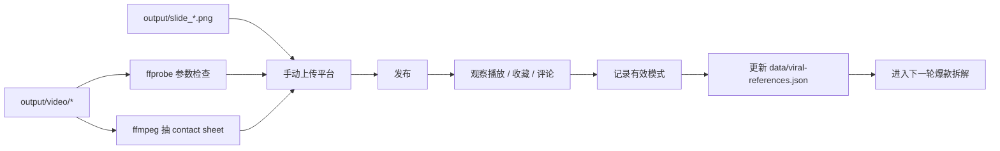

## 数据流总览

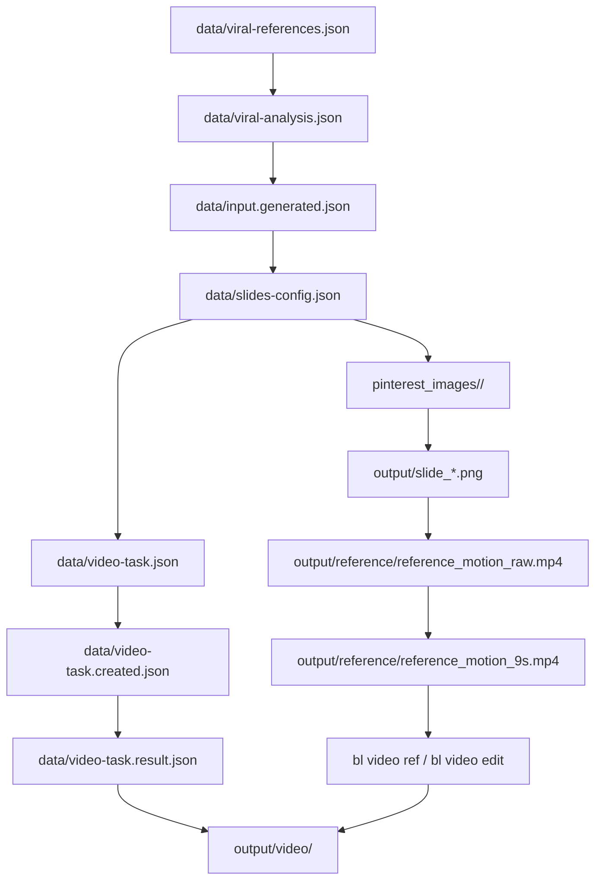

## 能力与脚本对应表

| 能力 | 脚本 | 命令 | 主要输出 |
| --- | --- | --- | --- |
| 爆款拆解 | `scripts/analyze-viral.mjs` | `npm run analyze` | `viral-analysis.json` / `input.generated.json` |
| 幻灯片方案 | `scripts/generate-plan.mjs` | `npm run plan` | `slides-config.json` |
| 背景图生成 | `scripts/generate-images.mjs` | `npm run images` | 背景图文件 |
| 图片渲染 | `scripts/render-slides.mjs` | `npm run render` | `output/slide_*.png` |
| 视频下载 | `scripts/download-video.mjs` | `npm run video:download` | `output/reference/*.mp4` |
| 动作参考准备 | `scripts/prepare-motion-reference.mjs` | `npm run video:motion` | 参考视频 / 第一帧 / contact sheet |
| 参考视频生成 | `scripts/run-bl-video.mjs` | `npm run video:ref` | 动作迁移视频 |
| 视频编辑主体替换 | `scripts/run-bl-video.mjs` | `npm run video:edit` | 主体替换视频 |
| 视频任务创建 | `scripts/create-video-task.mjs` | `npm run video:create` | `video-task.created.json` |
| 视频任务轮询 | `scripts/poll-task.mjs` | `npm run video:poll` | `video-task.result.json` / 视频文件 |
| 视频校验 | `scripts/check-video.mjs` | `npm run video:check` | 视频参数 / contact sheet |
